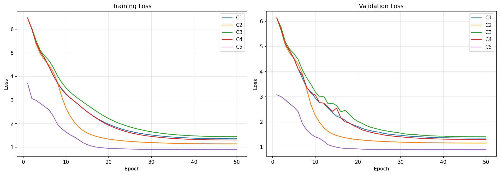

## Results

### Validation Loss


### Performance Metrics

| Configuration | Bit-Level Acc | Sequence Acc | Levenshtein (Norm) | BLEU | ROUGE-L |
|---------------|---------------|--------------|--------------------|------|---------|
| C1 | 0.8816 | 0.2179 | 0.0309 | 81.7926 | 0.9148 |
| C2 | 0.9691 | 0.6799 | 0.0067 | 95.2901 | 0.9791 |
| C3 | 0.8592 | 0.1407 | 0.0418 | 77.1872 | 0.8926 |
| C4 | 0.8995 | 0.3009 | 0.0213 | 85.7997 | 0.9351 |
| C5 | 0.9992 | 0.8831 | 0.0023 | N/A - token-free | N/A - token-free |

### Naive Baselines
*Evaluated on the raw test set prior to model evaluation to contextualize bit-level accuracy.*

| Baseline | Bit-Level Acc | Sequence Acc | Levenshtein (Norm) |
|----------|---------------|--------------|--------------------|
| Most Frequent Byte | 0.6614 | 0.0000 | 0.8317 |
| Unigram Sample | 0.6740 | 0.0000 | 0.8362 |

### Resource Utilization

| Configuration | Tokens/Sec | Bytes/Sec | Peak VRAM (MB) | Epoch Time (s) |
|---------------|------------|-----------|----------------|----------------|
| C1 | 9460.7 | 36142.4 | 3018.6 | 98.1 |
| C2 | 8520.1 | 32548.9 | 3017.4 | 109.0 |
| C3 | 9881.9 | 37718.6 | 3003.7 | 94.0 |
| C4 | 9614.7 | 36744.0 | 2837.3 | 96.6 |
| C5 | 20995.9 | 44961.9 | 3046.7 | 115.1 |

*Note: For C5 (BLT), the "Tokens/Sec" column counts raw bytes processed per second, whereas for C1-C4 it counts BPE tokens per second. Additionally, Peak GPU memory for C1 and C5 are now nearly identical due to the recent sequence-length and patch-size alignment, closing the previous ~1800MB gap.*

## Instructions to Reproduce

1. Setup environment and install dependencies:
   ```bash
   pip install -r requirements.txt
   ```
2. Run the main orchestration script (trains all 5 models sequentially):
   ```bash
   python -m src.train all
   ```
3. Or run a single configuration:
   ```bash
   python -m src.train c1
   ```
