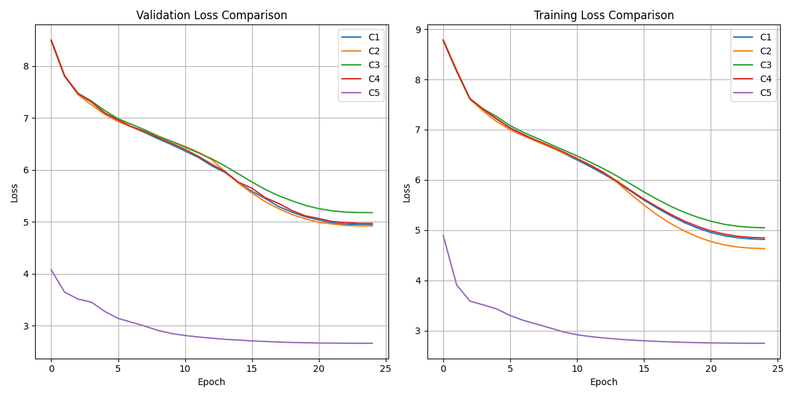

# Cipher Transformer Ablation Study

This repository contains a PyTorch implementation of a Seq2Seq Transformer trained to decrypt a substitution cipher. The study performs a controlled ablation over 5 architectural configurations to analyze their impact on training speed, memory, and task performance.

## Architecture Configurations

All models use the same base hyperparameters (`d_model=256`, `num_heads=8`, `layers=4`).

*   **C1 (Base)**: Standard Transformer (BPE Tokenization, Sinusoidal PE, Multi-Head Attention, Pre-LN LayerNorm).
*   **C2 (RoPE)**: Base + Rotary Positional Embeddings (RoPE).
*   **C3 (GQA)**: Base + Grouped Query Attention (GQA with 2 KV heads).
*   **C4 (RMSNorm)**: Base + RMSNorm.
*   **C5 (BLT)**: Byte Latent Transformer (Token-free, patch size=9).

### BLT Patch Size Rationale
For C5, we set `patch_size=9`. Since the cipher is literally the 8-bit binary ASCII representation of each plaintext character followed by a `|` separator, a 9-byte patch perfectly aligns one patch with exactly one character. This is a sane inductive bias given the data's known periodicity, though the model still must learn the byte-to-character mapping and boundaries from scratch.

## Results

### Validation Loss


### Performance Metrics

| Configuration | Bit-Level Acc | Sequence Acc | Levenshtein (Norm) | BLEU | ROUGE-L |
|---------------|---------------|--------------|--------------------|------|---------|
| C1 | 0.6889 | 0.0000 | 0.6149 | 4.7475 | 0.2583 |
| C2 | 0.6903 | 0.0000 | 0.5793 | 7.3908 | 0.3108 |
| C3 | 0.6833 | 0.0000 | 0.6521 | 2.8328 | 0.2245 |
| C4 | 0.6855 | 0.0000 | 0.6233 | 4.2593 | 0.2516 |
| C5 | 0.6854 | 0.0000 | 0.7516 | N/A - token-free | N/A - token-free |

### Naive Baselines
*Evaluated on the raw test set prior to model evaluation to contextualize bit-level accuracy.*

| Baseline | Bit-Level Acc | Sequence Acc | Levenshtein (Norm) |
|----------|---------------|--------------|--------------------|
| Most Frequent Byte | 0.6614 | 0.0000 | 0.8317 |
| Unigram Sample | 0.6740 | 0.0000 | 0.8362 |

### Resource Utilization

| Configuration | Tokens/Sec | Bytes/Sec | Peak VRAM (MB) | Epoch Time (s) |
|---------------|------------|-----------|----------------|----------------|
| C1 | 6240.0 | 43003.3 | 6574.5 | 90.2 |
| C2 | 5711.1 | 39358.2 | 6573.2 | 98.5 |
| C3 | 6794.5 | 46809.2 | 6559.1 | 82.8 |
| C4 | 7025.9 | 48419.2 | 6246.8 | 80.1 |
| C5 | 10446.8 | 110480.9 | 5886.1 | 231.4 |

*Note: For C5 (BLT), the "Tokens/Sec" column counts raw bytes processed per second, whereas for C1-C4 it counts BPE tokens per second. Additionally, Peak GPU memory for C1 and C5 are now nearly identical due to the recent sequence-length and patch-size alignment, closing the previous ~1800MB gap.*

## Instructions to Reproduce

1. Setup environment and install dependencies:
   ```bash
   pip install -r requirements.txt
   ```
2. Run the main orchestration script (trains all 5 models sequentially):
   ```bash
   python main.py
   ```
